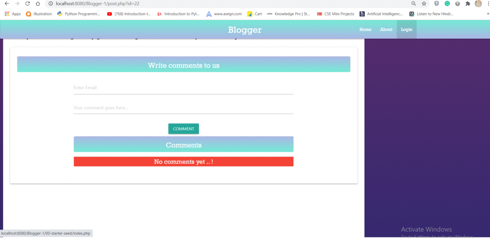

# Auth0 + PHP Web App Sample

This sample demonstrates how to add authorization to a [PHP](http://php.net/) web app using [Auth0](https://auth0.com).

Check the [PHP Quickstart](https://auth0.com/docs/quickstart/webapp/php) to better understand this sample.

## Getting Started

Before starting, make sure you have `composer` and `php` installed.

Copy the `.env.example` file to `.env` and populate it with your app's Domain, Client ID, and Client Secret. These can be retrieved from your [Auth0 dashboard](https://manage.auth0.com).

## Running the App

```bash
composer install
php -S localhost:3000
```

The app will be served at [http://localhost:3000/](http://localhost:3000/).

## Running the App With Docker

Before starting, make sure you have `docker` installed.

Rename the `.env.example` file to `.env` and populate it like explained [previously](#getting-started).

Execute in command line `sh exec.sh` to run the Docker in Linux, or `.\exec.ps1` to run the Docker in Windows.

The app will be served at [http://localhost:3000/](http://localhost:3000/).

## Create a free account in Auth0

1. Go to [Auth0](https://auth0.com) and click Sign Up.
2. Use Google, GitHub or Microsoft Account to login.

## Vulnerability Reporting

Please do not report security vulnerabilities on the public GitHub issue tracker. The [Responsible Disclosure Program](https://auth0.com/whitehat) details the procedure for disclosing security issues.

## What is Auth0?

Auth0 helps you to easily:

- implement authentication with multiple identity providers, including social (e.g., Google, Facebook, Microsoft, LinkedIn, GitHub, Twitter, etc), or enterprise (e.g., Windows Azure AD, Google Apps, Active Directory, ADFS, SAML, etc.)
- log in users with username/password databases, passwordless, or multi-factor authentication
- link multiple user accounts together
- generate signed JSON Web Tokens to authorize your API calls and flow the user identity securely
- access demographics and analytics detailing how, when, and where users are logging in
- enrich user profiles from other data sources using customizable JavaScript rules

[Why Auth0?](https://auth0.com/why-auth0)

## License

This project is licensed under the MIT license. See the [LICENSE](https://github.com/auth0-samples/auth0-php-web-app/blob/master/LICENSE) file for more info.




